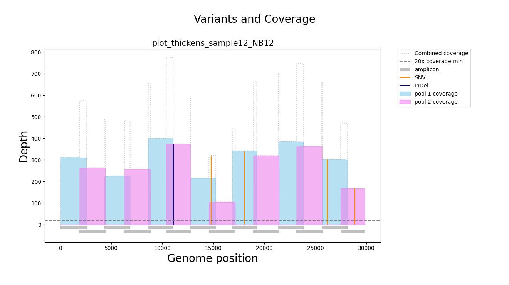

# CoVarPlot

CoVarPlot - Covarage Variant Plots for viral whole genome sequencing

This script was created as part of the interARTIC project, and is the code that generates the output plots.

Input currently only supports that generated by the artic pipelines, but should work for any virus, or primer scheme you have used.

Plans to generate depth plots from bam file is on the TODO list

Feedback is welcome.

### setup

Use python3, and install the libs needed.

    pip3 install matplotlib numpy

You might need tk or somthine like it for the --show option if you don't already have it installed.

### Run

    usage: covarplot.py [-h] [--version] [-v VCF_FILE] [-d1 DEPTH_FILE_1]
                    [-d2 DEPTH_FILE_2] [-b BED] [--show]

    Plots for interArtic

    optional arguments:
      -h, --help            show this help message and exit
      --version             Prints version
      -v VCF_FILE, --vcf_file VCF_FILE
                            full path to vcf file (default: None)
      -d1 DEPTH_FILE_1, --depth_file_1 DEPTH_FILE_1
                            full path to depth file 1 (default: None)
      -d2 DEPTH_FILE_2, --depth_file_2 DEPTH_FILE_2
                            full path to depth file 2 (default: None)
      -b BED, --bed BED     full path to scheme bed file (default: None)

Example command:

    python3 covarplot.py -v sample1.pass.vcf.gz -d1 sample1.coverage_mask.txt.nCoV-2019_1.depths -d2 sample1.coverage_mask.txt.nCoV-2019_2.depths -b primer-schemes/eden/nCoV-2019/V1/nCoV-2019.scheme.bed --show

If `--show` isn't used it wil save to the same path as the VCF file (as a .png). I'll add some save path features soon

You can also run this plot with JUST the `-d1` and `-d2` flags, or just the `-v` flag, and get either a coverage or variant plot respectively. Include the `-b` flag in each though. (I'll make this option too soon)

## Example

